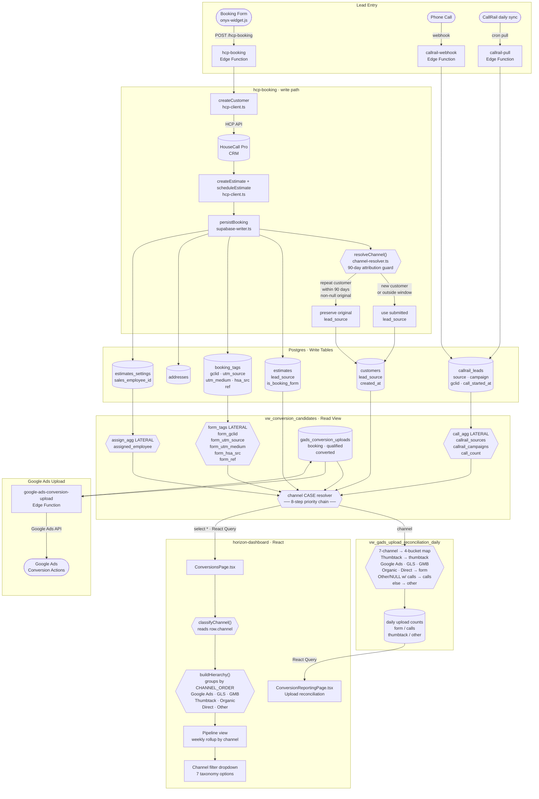

# Lead Management System — Architecture

## Overview

Leads enter the system through two paths: a booking form (online) and phone calls tracked via CallRail. Both paths converge in Supabase where attribution signals are resolved into a single taxonomy channel and made available to the dashboard.

---

## Mermaid Diagram



---

## Key Data Flows

| Signal | Written by | Read by |
|---|---|---|
| `estimates.lead_source` | `hcp-booking` via `resolveChannel()` | `vw_conversion_candidates` step 1 |
| `booking_tags.{gclid,utm_source,…}` | `hcp-booking` · `persistBooking()` | `form_tags` LATERAL in view |
| `callrail_leads.source` | `callrail-webhook` / `callrail-pull` | `call_agg` LATERAL in view |
| `vw_conversion_candidates.channel` | Computed in view | `ConversionsPage`, `vw_gads_upload_reconciliation_daily` |
| `gads_conversion_uploads.status` | `google-ads-conversion-upload` | `vw_conversion_candidates` upload stage columns |

## Attribution Guard (90-day window)

```
resolveChannel(submittedChannel, existingLeadSource, existingCreatedAt)
  │
  ├─ existingCreatedAt within 90 days AND existingLeadSource non-null?
  │     → withinWindow=true, preserveOriginal=true
  │     → write existingLeadSource to both estimates.lead_source and customers.lead_source
  │
  └─ otherwise (new customer, outside window, or null original)
        → write submittedChannel to both
```
