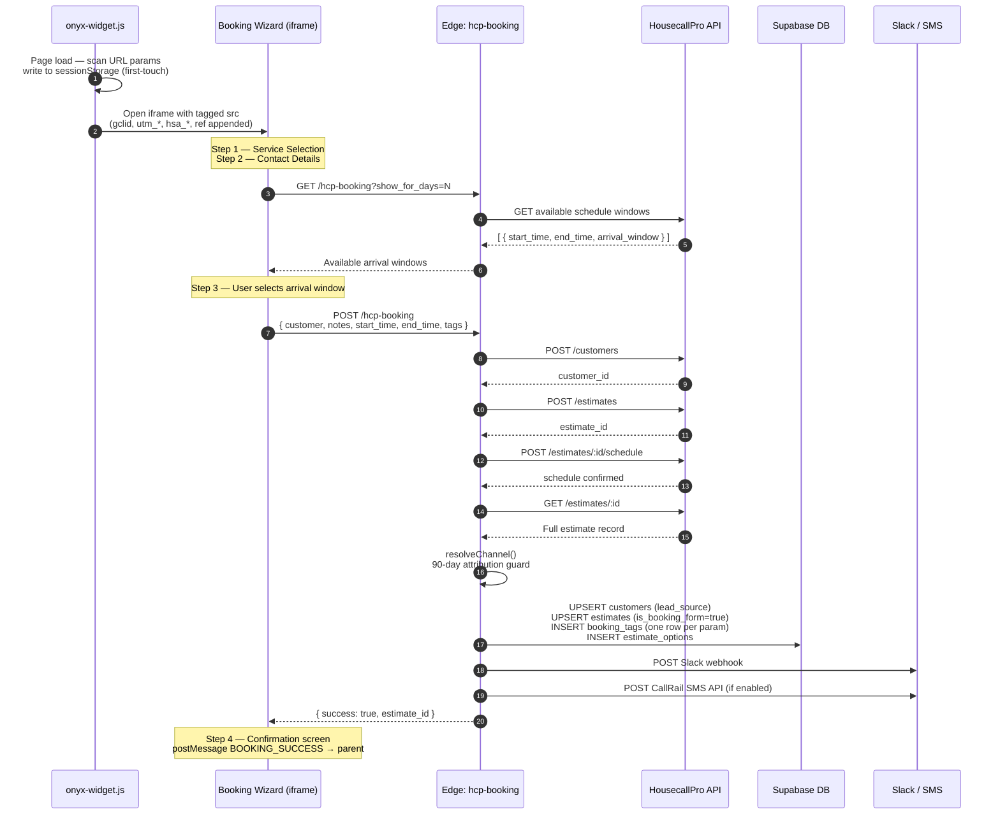
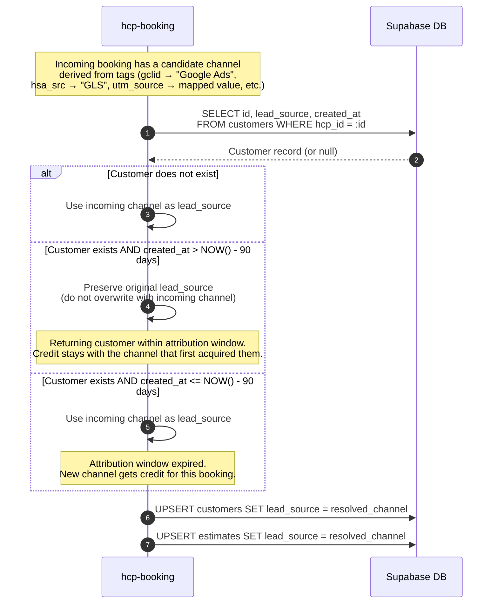
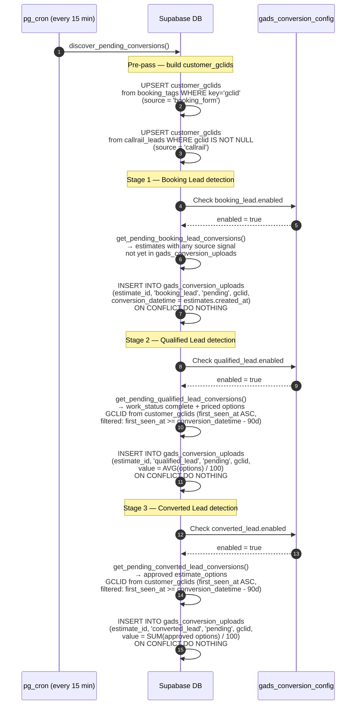
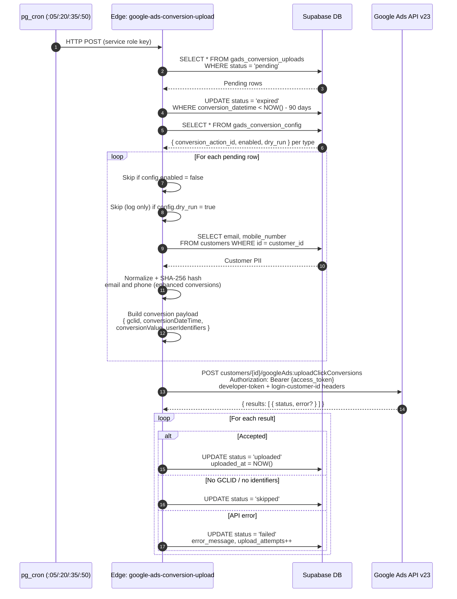

## ADDED Requirements

### Requirement: Full-stack architecture reference document exists
The system SHALL have a canonical architecture reference document that describes every layer of the ONYX platform from embedded booking widget to Google Ads conversion upload, including data models, logic rules, and integration contracts.

#### Scenario: Architecture overview is accessible
- **WHEN** a developer or stakeholder needs to understand how the ONYX system works end-to-end
- **THEN** they SHALL find a single document that covers all components, data flows, and key logic decisions without needing to read source files or migration history

---

## Architecture: ONYX Full-Stack Reference

### System Overview

ONYX is a field-service business intelligence platform for a home services company. It connects:

- **HousecallPro (HCP)** — the field CRM where estimates, jobs, schedules, and customers live
- **Booking widget** — a self-contained JS script embedded on client-facing websites that captures attribution and opens an iframe booking form
- **Supabase** — Postgres + Edge Functions serving as the data hub and automation engine
- **CallRail** — call tracking; calls and form fills are received via webhook and synced historically
- **Google Ads** — offline conversion upload (3 stages per lead) and analytics snapshot
- **React Dashboard** — internal app for operations, sales, commissions, and conversion management


---

### Sequence: Booking Flow



---

### Sequence: resolveChannel() — 90-Day Attribution Guard



---

### Sequence: Conversion Discovery



---

### Sequence: Conversion Upload



---

### Stage 1: Attribution Capture (Booking Widget)

**Component:** `onyx-widget.js` (embedded on client website)

**What it does:**  
The widget script runs immediately on page load before the user interacts with anything. It scans `window.location.search` for all tracked URL parameters and stores them in `sessionStorage['onyx_attribution']`.

**Tracked parameters:**
| Parameter | Purpose |
|---|---|
| `gclid` | Google Ads click ID |
| `gbraid` / `wbraid` | Google Ads app/web click IDs |
| `gad_source` / `gad_campaignid` | Google Ads source metadata |
| `utm_source`, `utm_medium`, `utm_campaign`, `utm_content`, `utm_term` | UTM tracking parameters |
| `hsa_src`, `hsa_cam`, `hsa_grp`, `hsa_ad`, `hsa_net`, `hsa_kw`, etc. | HubSpot/SA360 click params (used to detect GLS: `hsa_src=LocalServicesAds`) |
| `fbclid` | Facebook Ads click ID |
| `ttclid` | TikTok Ads click ID |
| `msclkid` | Microsoft Ads click ID |
| `ref` | Referrer override (or captured from `document.referrer`) |

**First-touch wins semantics:**  
If `sessionStorage['onyx_attribution']` already has a value for a key, it is NOT overwritten. This means the attribution from the user's first landing page visit on this session is preserved even if they navigate around.

**On button click:**  
`buildSrc()` reads the live URL params first, then falls back to sessionStorage for any missing keys. All tracked params are appended to the iframe `src` URL, so the booking form always has the full attribution context.

---

### Stage 2: Booking Form (BookingWizard — iframe)

**Component:** `BookingWizard` React component (inside the iframe at `/booking` or `/booking-page`)

**4-step flow:**

| Step | Component | What happens |
|---|---|---|
| 1 | `ServiceSelection` | User picks service category and size (e.g., "Regular Cleaning — 3BR/2BA") |
| 2 | `ContactDetails` | User enters name, email, phone, service address |
| 3 | `ArrivalWindow` | Widget calls `GET /functions/v1/hcp-booking?show_for_days=N` → HCP API returns available 4-hour arrival windows. User selects one. |
| 4 | `BookingSuccess` | Confirmation screen. Posts `BOOKING_SUCCESS` message to parent (triggers GTM/pixel events). |

**`buildLeadSource()` — client-side channel pre-resolution:**  
Before the form submits, the widget builds an initial `lead_source` string for the `customer` payload. Priority order:
1. `gclid` present → `"Google Ads"`
2. `hsa_src = 'LocalServicesAds'` → `"GLS"`  
3. `utm_source` maps to a known channel
4. Referrer hostname matches known domains
5. Fallback: `"Direct"`

This value is sent in the POST body and later overridden by server-side channel resolution if necessary.

---

### Stage 3: Booking Submission (hcp-booking Edge Function)

**Component:** `supabase/functions/hcp-booking/index.ts`

**POST body:**
```json
{
  "customer": { "first_name", "last_name", "email", "mobile_number", "address", "lead_source" },
  "notes": "Service type + customer notes",
  "start_time": "ISO8601",
  "end_time": "ISO8601",
  "tags": { "gclid": "...", "utm_source": "...", "ref": "...", ... }
}
```

**Execution sequence:**

1. **`createCustomer()`** — POST to HCP API `/customers`. Returns HCP customer ID.
2. **`createEstimate()`** — POST to HCP API `/estimates` with the customer ID and service notes.
3. **`scheduleEstimate()`** — POST to HCP API to attach a 4-hour schedule block to the estimate.
4. **`getFullEstimate()`** — GET from HCP to fetch the created estimate with all fields populated (including the new estimate ID).
5. **`persistBooking()`** — Write to Supabase (see Stage 4).
6. **`notifySlack()`** — POST to configured Slack Incoming Webhook with booking summary.
7. **`notifySms()`** — If `sms_enabled`, POST to CallRail SMS API to send confirmation to customer.

---

### Stage 4: Supabase Persistence & Channel Resolution

**Component:** `supabase-writer.ts` → `channel-resolver.ts` (inside `hcp-booking`)

**`resolveChannel()` — 90-day attribution guard:**

This function decides what value gets written to `customers.lead_source` and `estimates.lead_source`.

```
IF customer already exists in Supabase
  AND customers.created_at > NOW() - 90 days
  THEN preserve the ORIGINAL lead_source (do not overwrite)
  ELSE use the incoming channel from this booking
```

**Rationale:** If the same customer books again within 90 days, the new booking is still attributed to the channel that originally acquired them — preventing re-attribution of a returning customer to a different channel (e.g., direct/organic second visit overwriting a Google Ads first touch).

**Database writes:**
| Table | What is written |
|---|---|
| `customers` | Upserted on HCP customer ID. `lead_source` = resolved channel. |
| `estimates` | Upserted on HCP estimate ID. `is_booking_form = true`, `lead_source` = resolved channel. |
| `addresses` | Upserted service address linked to customer. |
| `estimate_options` | Inserted (one row per option from HCP response). |
| `booking_tags` | One row per tag key/value pair. `UNIQUE(estimate_id, key)` — idempotent re-runs are safe. |

---

### Stage 5: Lead Channel Taxonomy

The system uses a 7-value channel taxonomy applied consistently across both write-time and read-time resolution.

**Channels:**
| Channel | Meaning |
|---|---|
| `Google Ads` | Click from a paid search/display ad; identified by `gclid` |
| `GLS` | Google Local Services Ad; identified by `hsa_src=LocalServicesAds` or ref URL pattern `google.com/localservices` |
| `GMB` | Google My Business profile; identified by `utm_source=gmb` or `lead_source='Reserve with Google'` |
| `Thumbtack` | Thumbtack marketplace; identified by `utm_source=thumbtack` |
| `Organic` | Organic search or known search engine referrer |
| `Direct` | No referrer, no UTM, no click ID |
| `Other` | Any signal not matching above |

**Read-time resolution in `vw_conversion_candidates`:**  
The view applies the following CASE priority chain on every row:

1. `estimates.lead_source` is one of the 7 taxonomy values → use it directly
2. `estimates.lead_source = 'Reserve with Google'` → `'GMB'`
3. `booking_tags.gclid` IS NOT NULL → `'Google Ads'`
4. `booking_tags.hsa_src = 'LocalServicesAds'` → `'GLS'`
5. `booking_tags.utm_source` → mapped to taxonomy
6. `booking_tags.ref` matches `google.com/localservices` → `'GLS'`
7. `callrail_leads.source` string-matched to taxonomy patterns
8. Fallback → `'Other'`

---

### Stage 6: HCP Data Sync (hcp-import-data)

**Component:** `supabase/functions/hcp-import-data/index.ts`

**Purpose:** Keeps Supabase tables in sync with HCP master data (not booking-created records, but the full CRM state including status changes, job completions, invoices, etc.).

**Import types (selected via `importType` POST body param):**
| Type | Source | Target table(s) |
|---|---|---|
| `employees` | HCP `/employees` | `employees` |
| `estimates` | HCP `/estimates` with pagination | `customers`, `estimates`, `estimate_options`, `addresses`, `schedules`, `estimates_settings` |
| `jobs` | HCP `/jobs` | `jobs` |
| `invoices` | HCP `/invoices` | `invoices` |
| `all` | All of the above in sequence | All of the above |

**Key behavior:**  
- Upserts on HCP ID — safe to re-run.  
- Does NOT overwrite `is_booking_form` — this is only set by `hcp-booking` and backfilled by migration.  
- Does NOT overwrite `booking_tags` — those only come from actual booking form submissions.

---

### Stage 7: CallRail Attribution

**Components:** `supabase/functions/callrail-webhook/`, `supabase/functions/callrail-pull/`, `correlate_callrail_estimate()` trigger, `resync_callrail_estimates()` function.

**Real-time webhook path:**
1. CallRail POST → `callrail-webhook` edge function
2. Validate HMAC-SHA1 signature using `CALLRAIL_WEBHOOK_SIGNING_KEY`
3. `detectWebhookType()` → determines if this is a `call` or `form_submission`
4. `mapPayloadToRow()` → maps CallRail fields to `callrail_leads` schema
5. Upsert into `callrail_leads` on `callrail_id` (idempotent)
6. `correlate_callrail_estimate()` trigger fires automatically

**`correlate_callrail_estimate()` trigger logic:**  
Matches the new `callrail_leads` row to an existing customer and estimate:
1. Try to match by `customer_phone` (last 10 digits, strips formatting)
2. If no match, try `customer_email`
3. If no match, try customer name
4. If a customer is found, set `callrail_leads.customer_id`
5. Find the most recent estimate for that customer and set `callrail_leads.estimate_id`

**Resync cron (every 30 min):**  
`resync_callrail_estimates()` re-runs the matching logic for any `callrail_leads` rows where `estimate_id IS NULL`. Handles cases where the call arrives before the booking is created in HCP.

**Historical backfill:**  
`callrail-pull` edge function polls CallRail API v3 with date range + pagination (250/page). Fetches extended fields including `gclid`, `lead_status`, `milestones`, `sentiment`, `call_summary`. Used for one-time or periodic backfills.

---

### Stage 8: GCLID First-Touch Attribution (customer_gclids)

**Table:** `customer_gclids`  
**Schema:** `customer_id`, `gclid`, `source` (booking_form / callrail), `first_seen_at`, `estimate_id`  
**Unique constraint:** `(customer_id, gclid)`

**Purpose:**  
Enables cross-estimate, customer-scoped first-touch attribution for the Qualified Lead and Converted Lead conversion stages (which happen weeks after booking, when estimates are priced and approved).

**Population — pre-pass in `discover_pending_conversions()`:**  
Before discovery runs, the pre-pass upserts `customer_gclids` rows from two sources:
1. `booking_tags` where `key = 'gclid'` → source = `'booking_form'`
2. `callrail_leads` where `gclid IS NOT NULL` and `customer_id IS NOT NULL` → source = `'callrail'`

**First-touch resolution (with click lookback window):**  
When the pipeline needs a GCLID for Qualified/Converted stages, it queries `customer_gclids`, filters to rows within the click lookback window (`first_seen_at >= conversion_datetime - INTERVAL '90 days'`), and picks the earliest eligible `first_seen_at` (first-touch within window). If no GCLID is within the window, the value is NULL and the upload phase falls back to enhanced conversions.

**Google Ads — two independent time constraints:**

```
                    click_through_lookback_window_days
                    (per-ConversionAction setting, default 30d, max 90d)
                    ◄──────────────────────────────────►
                                                        │
       Click ──────────────────────────────────► Conversion ────────────────────► Upload
       (GCLID born)                             (conversion_datetime)            (now)
       first_seen_at                                       ◄────────────────────►
                                                           Upload recency window
                                                           90 days (hard API limit)
```

| Constraint | Window | Reference point | Enforced by |
|---|---|---|---|
| Window 1 — Upload recency | `conversion_datetime >= now() - 90d` | Upload time | Upload edge function (`status = 'expired'`) |
| Window 2 — Click lookback | `first_seen_at >= conversion_datetime - 90d` | Conversion event | Discovery SQL functions (GCLID subquery filter) |

These are distinct. Window 1 catches stale *conversions*. Window 2 catches stale *clicks*. A row can pass Window 1 and fail Window 2 (recent conversion with an old click), which was the source of perpetual-pending failures before this constraint was added.

**Architecture spec maintenance requirement:**  
After any implementation that changes the behavior of a pipeline stage, this spec SHALL be updated to reflect the new behavior before the change is archived.

---

### Stage 9: Conversion Pipeline (3 Stages)

**Table:** `gads_conversion_uploads` — one row per `(estimate_id, conversion_type)`  
**Config table:** `gads_conversion_config` — one row per type with `conversion_action_id`, `enabled`, `dry_run`

#### Stage 9a: Booking Lead

| Field | Value |
|---|---|
| Trigger condition | `is_booking_form = true` OR `booking_tags` rows exist OR `callrail_leads` correlated OR `lead_source IS NOT NULL` |
| `conversion_datetime` | `estimates.created_at` |
| `conversion_value` | NULL (no price yet) |
| GCLID source | `booking_tags.gclid` or correlated `callrail_leads.gclid` |

#### Stage 9b: Qualified Lead

| Field | Value |
|---|---|
| Trigger condition | `work_status IN ('complete rated', 'complete unrated')` AND at least one `estimate_option.total_amount > 0` |
| `conversion_datetime` | `estimates.updated_at` at time of qualification |
| `conversion_value` | `AVG(all estimate_options.total_amount) / 100.0` (dollars) |
| GCLID source | `customer_gclids` first-touch (earliest `first_seen_at`) |

**Note:** Uses the customer-level GCLID, not the estimate-level one, because by this stage the technician has visited and the estimate has been priced. The customer may have multiple estimates; first-touch ensures the original acquisition channel gets credit.

#### Stage 9c: Converted Lead

| Field | Value |
|---|---|
| Trigger condition | At least one `estimate_option.approval_status IN ('approved', 'pro approved')` |
| `conversion_datetime` | `MAX(approved estimate_options.updated_at)` |
| `conversion_value` | `SUM(approved estimate_options.total_amount) / 100.0` (dollars) |
| GCLID source | `customer_gclids` first-touch |

#### Discovery cron (every 15 min):
```
discover_pending_conversions()
  ├─ Pre-pass: upsert customer_gclids from booking_tags + callrail_leads
  ├─ IF booking_lead.enabled: get_pending_booking_lead_conversions() → INSERT pending rows
  ├─ IF qualified_lead.enabled: get_pending_qualified_lead_conversions() → INSERT pending rows
  └─ IF converted_lead.enabled: get_pending_converted_lead_conversions() → INSERT pending rows
     (all INSERT … ON CONFLICT DO NOTHING — idempotent)
```

#### Upload state machine:
```
pending ──► uploaded   (Google Ads accepted)
       ──► skipped     (no GCLID, no hashed identifiers)
       ──► expired     (conversion_datetime > 90 days)
       ──► failed      (API error; retry on next run; increments upload_attempts)
```

---

### Stage 10: Google Ads Conversion Upload

**Component:** `supabase/functions/google-ads-conversion-upload/index.ts`  
**Triggered by:** pg_cron at :05, :20, :35, :50 via pg_net HTTP call

**Execution sequence:**

1. Read all `gads_conversion_uploads` rows with `status = 'pending'`
2. For rows where `conversion_datetime < NOW() - 90 days` → set `status = 'expired'`
3. For each remaining pending row:
   a. Look up `gads_conversion_config` for this `conversion_type`
   b. If `enabled = false` → skip
   c. If `dry_run = true` → log but do not call Google Ads API
   d. Resolve `conversion_action` resource name: `customers/{customer_id}/conversionActions/{action_id}`
   e. Build conversion payload:
      - `gclid` (from the upload row)
      - `conversionDateTime` (formatted as `YYYY-MM-DD HH:MM:SS+00:00`)
      - `conversionValue` (if present)
      - `userIdentifiers` with SHA-256 hashed email and/or phone from `customers` table (enhanced conversions)
4. Batch all payloads into a single `uploadClickConversions` API call
5. Process response — update each row's `status`, `uploaded_at`, `error_message`, `conversion_action` (for audit)

**Enhanced conversions:**  
Customer `email` is normalized (lowercase, trim) then `SHA-256` hashed. Phone is normalized (E.164 format) then `SHA-256` hashed. These are sent as `userIdentifiers` alongside the GCLID to improve match rates for conversions where the GCLID may have expired or be unavailable.

**Google Ads API credentials (Supabase secrets):**
- `GOOGLE_ADS_DEVELOPER_TOKEN`
- `GOOGLE_ADS_CLIENT_ID`, `GOOGLE_ADS_CLIENT_SECRET`, `GOOGLE_ADS_REFRESH_TOKEN`
- `GOOGLE_ADS_CUSTOMER_ID` (direct account, no dashes)
- `GOOGLE_ADS_LOGIN_CUSTOMER_ID` (MCC manager, optional)

**Auth pattern:** Supabase secret `GOOGLE_ADS_REFRESH_TOKEN` → exchanged for short-lived access token via Google OAuth2 token endpoint → used as `Authorization: Bearer` on API requests.

---

### Stage 11: Google Ads Analytics Sync

**Component:** `supabase/functions/gads-upload-analytics/index.ts`  
**Component:** `supabase/functions/google-ads-sync/index.ts`  
**Triggered by:** pg_cron daily at 04:00 UTC

**`gads-upload-analytics` — what it fetches:**
| Data | Table |
|---|---|
| Attribution snapshots by conversion action and date | `gads_attribution_snapshots` |
| Client-level upload health (click vs. call client) | `gads_client_upload_health` |
| Action-level upload health per run | `gads_action_upload_health` |
| Conversion action config snapshot | `gads_action_config_snapshots` |

**`google-ads-sync` — campaign spend:**  
Uses GAQL to query yesterday's `campaign.id`, `ad_group.id`, `metrics.cost_micros`, `metrics.clicks`, `metrics.impressions` by `segments.date`. Upserts into `ads_campaign_stats` on `(campaign_id, ad_group_id, date)`.

---

### Stage 12: Dashboard (React Frontend)

**Stack:** React 18 + TypeScript + Vite + React Router v6 + TanStack Query v5 + shadcn/ui + Tailwind CSS

**Auth:** `AuthContext` wraps the app. On mount: `supabase.auth.getSession()`. On change: `onAuthStateChange`. All routes behind an auth guard; unauthenticated users see `LoginPage`.

**API pattern:** All data fetching uses the Supabase JS client with the anon key. Edge function calls use `supabase.functions.invoke()` which automatically attaches the user's JWT as `Authorization: Bearer`.

**Key pages:**

| Route | Page | Data source |
|---|---|---|
| `/conversions/uploads` | `ConversionsPage` | `vw_conversion_candidates` direct query |
| `/online-bookings` | `OnlineBookingsPage` | `vw_booking_estimates` direct query |
| `/calls` | `CallsPage` | `vw_callrail_leads` direct query |
| `/marketing` | `MarketingPage` | `ads_campaign_stats`, `gads_attribution_snapshots` |
| `/sales` | `SalesPage` | `fn_get_sales_table_data()` RPC |
| `/conversions/config` | `ConversionConfigPage` | `GET/PUT /functions/v1/gads-conversion-config` |
| `/conversions/upload-report` | `UploadReportPage` | `vw_gads_upload_reconciliation_daily` |

**`vw_conversion_candidates` — central pipeline view:**  
One row per estimate with any lead signal. Columns include:
- `channel` (7-value taxonomy, computed via CASE chain — see Stage 5)
- `booking_lead_status`, `qualified_lead_status`, `converted_lead_status` — upload status pivoted per stage
- `first_touch_medium`, `all_gclids` — attribution metadata
- `is_closed` — whether the estimate is in a terminal HCP status
- Call aggregation columns from correlated `callrail_leads`

---

### Configuration Singletons

All configuration is stored as JSONB singletons in Supabase, read/written by corresponding edge functions, and used at runtime.

| Table | Edge Function | Used By |
|---|---|---|
| `widget_tracking_config` | `widget-config` | Booking widget on load (injects GA4, GTM, Meta Pixel, TikTok, LinkedIn, Clarity, CallRail tracker scripts) |
| `booking_config` | `booking-config` | `hcp-booking` for SMS number/template; BookingWizard for sms_enabled flag |
| `slack_notify_config` | `slack-config` | `hcp-booking` `notifySlack()` for field visibility and color |
| `widget_designs` | `widget-designs` | Booking widget button rendering (styles array + selected design name) |

---

#### Scenario: New developer understands booking-to-conversion flow
- **WHEN** a new developer reads the full-stack-architecture spec
- **THEN** they SHALL be able to trace the path from a user clicking "Book Now" to a conversion appearing in Google Ads without reading any source files

#### Scenario: Channel taxonomy is documented
- **WHEN** a developer needs to understand how a lead gets its channel value
- **THEN** the spec SHALL explain both write-time (90-day guard in hcp-booking) and read-time (SQL CASE in vw_conversion_candidates) resolution with the full priority chain

#### Scenario: Conversion pipeline stages are documented
- **WHEN** a developer needs to understand what triggers each pipeline stage
- **THEN** the spec SHALL describe trigger conditions, datetime source, value source, and GCLID source for all three stages

#### Scenario: GCLID first-touch model is documented
- **WHEN** a developer needs to understand why a conversion uses a different GCLID than the booking_tag
- **THEN** the spec SHALL explain the customer_gclids table, its population pre-pass, and first-touch selection logic
